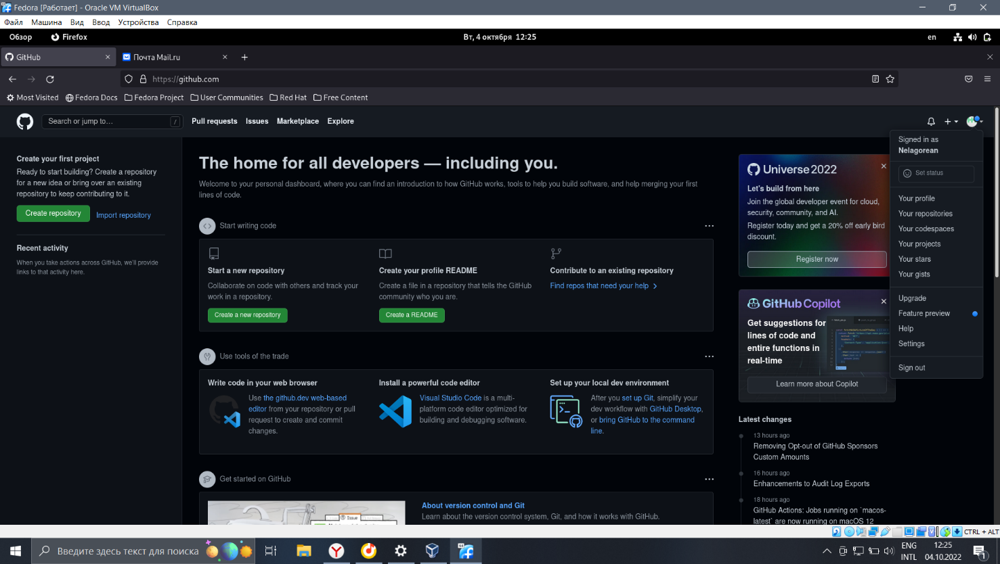
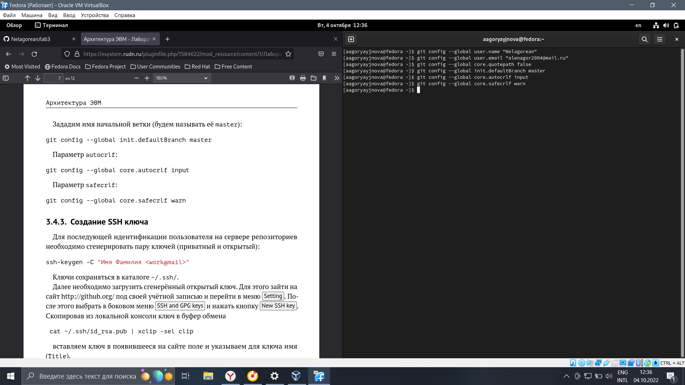
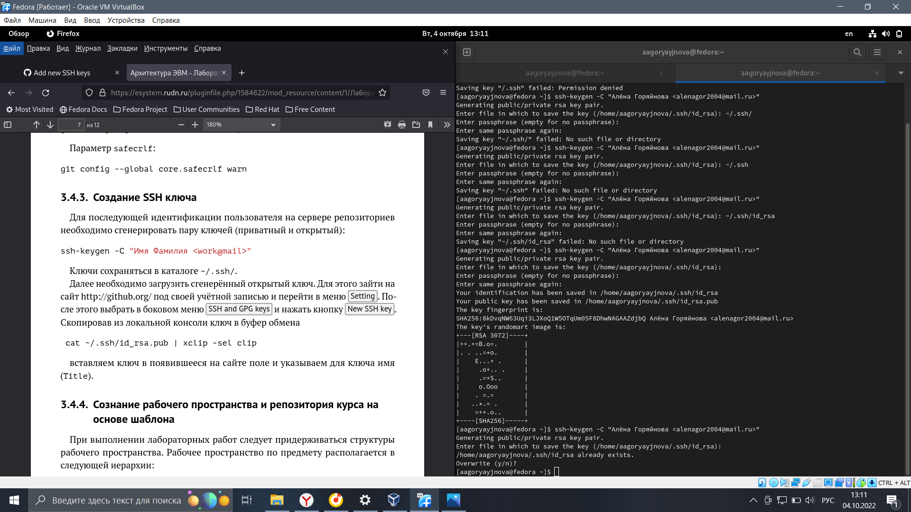
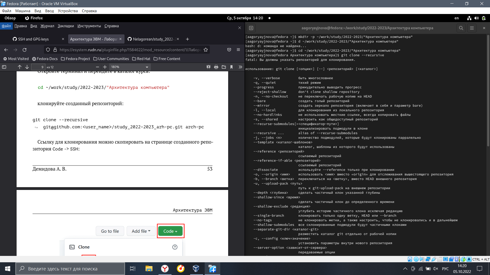
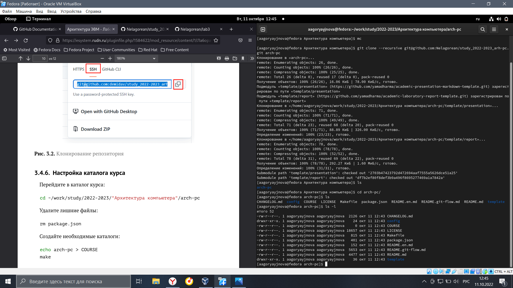
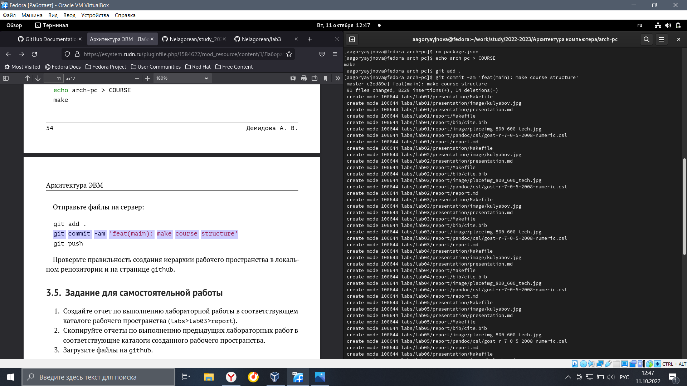
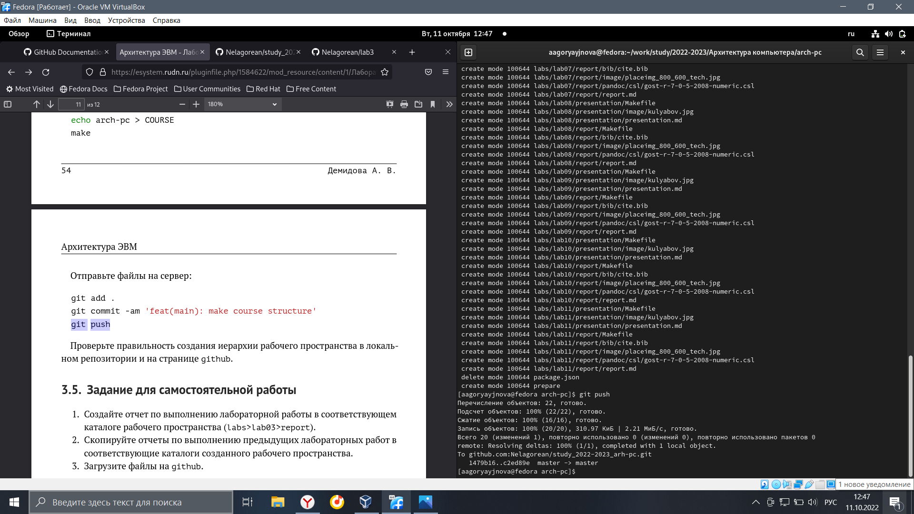

---
## Front matter
title: "Отчёт по лабораторной работе №3"
subtitle: "Система контроля версии Git"
author: "Горяйнова Алёна Андреевна"

## Generic otions
lang: ru-RU
toc-title: "Содержание"

## Bibliography
bibliography: bib/cite.bib
csl: pandoc/csl/gost-r-7-0-5-2008-numeric.csl

## Pdf output format
toc: true # Table of contents
toc-depth: 2
lof: true # List of figures
lot: true # List of tables
fontsize: 12pt
linestretch: 1.5
papersize: a4
documentclass: scrreprt
## I18n polyglossia
polyglossia-lang:
  name: russian
  options:
	- spelling=modern
	- babelshorthands=true
polyglossia-otherlangs:
  name: english
## I18n babel
babel-lang: russian
babel-otherlangs: english
## Fonts
mainfont: PT Serif
romanfont: PT Serif
sansfont: PT Sans
monofont: PT Mono
mainfontoptions: Ligatures=TeX
romanfontoptions: Ligatures=TeX
sansfontoptions: Ligatures=TeX,Scale=MatchLowercase
monofontoptions: Scale=MatchLowercase,Scale=0.9
## Biblatex
biblatex: true
biblio-style: "gost-numeric"
biblatexoptions:
  - parentracker=true
  - backend=biber
  - hyperref=auto
  - language=auto
  - autolang=other*
  - citestyle=gost-numeric
## Pandoc-crossref LaTeX customization
figureTitle: "Рис."
tableTitle: "Таблица"
listingTitle: "Листинг"
lofTitle: "Список иллюстраций"
lotTitle: "Список таблиц"
lolTitle: "Листинги"
## Misc options
indent: true
header-includes:
  - \usepackage{indentfirst}
  - \usepackage{float} # keep figures where there are in the text
  - \floatplacement{figure}{H} # keep figures where there are in the text
---

# Цель работы

Изучение идеологии и применения средств контроля версий. 
Приобретение практических навыков по работе с системой git.

# Задание

Зарегестрироватья на GitHub, настроить; создать SSH ключ, рабочее пространство и репозиторий курса на основе шаблона

# Теоретическое введение

**Система контроля версий Git** представляет собой набор программ команд-
ной строки. Доступ к ним можно получить из терминала посредством ввода
команды git с различными опциями.

Благодаря тому, что Git является распределённой системой контроля версий,
резервную копию локального хранилища можно сделать простым копировани-
ем или архивацие

# Выполнение лабораторной работы

Создала учётную запись на сайте https://github.com/ и заполнила основные данные (рис. [-@fig:1])

{ #fig:1 width=70% }

Сначала я сделала предварительную конфигурацию git. Открыла терминал и ввела указанные команды, указав свои имя и email; настроила utf-8 в выводе сообщений git; задала имя начальной ветки (master); задала параметры autocrlf и safecrlf (рис. [-@fig:2])

{ #fig:2 width=70% }

Сгенерировала SSH ключ; скопировав из локальной консоли ключ в буфер обмена и вставила его в появившееся на сайте поле; указала имя (for_lab3) (рис. [-@fig:3])

{ #fig:3 width=70% }

Открыла терминал и создала каталог для предмета «Архитектура 
компьютера» (рис. [-@fig:4])

{ #fig:4 width=70% }

Перешла по ссылке на станицу репозитория с шаблоном курса; выбрала Use this template. В открывшемся окне задала имя репозитория (study_2022–2023_arh-pc) и создала репозиторий; открыла терминал и перешла в каталог курса и клонировала созданный репозиторий (рис. [-@fig:5], [-@fig:6], [-@fig:7])

{ #fig:5 width=70% }

{ #fig:6 width=70% }

{ #fig:7 width=70% }

# Выводы

Я изученила идеологию и применение средств контроля версий. 
Приобрела практические навыки по работе с системой git

# Список литературы{.unnumbered}

::: {#refs}
:::
